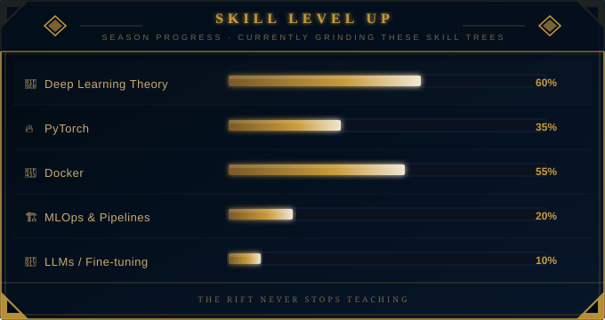

<div align="center">


<br/>

[](https://github.com/nibir-ai)

<br/>

[](https://github.com/nibir-ai?tab=followers)
&nbsp;
[](https://github.com/nibir-ai)
&nbsp;


</div>

---

## ⚔️ CHAMPION PROFILE

<table>
  <tr>
    <td><b>🧙 HERO</b></td>
    <td>Nibir Biswas</td>
    <td><b>🗺️ REGION</b></td>
    <td>India 🇮🇳 — Home Base 🏠</td>
  </tr>
  <tr>
    <td><b>👑 TITLE</b></td>
    <td><i>"The Neural Architect"</i></td>
    <td><b>⚔️ CLASS</b></td>
    <td>Mage / Assassin</td>
  </tr>
  <tr>
    <td><b>🐧 OS</b></td>
    <td>Linux &nbsp;←&nbsp; <i>non-negotiable</i></td>
    <td><b>🎯 LANE</b></td>
    <td>Mid Lane</td>
  </tr>
  <tr>
    <td><b>⚡ SPECIALTY</b></td>
    <td>Offline AI • Edge Models</td>
    <td><b>🔬 PLAYSTYLE</b></td>
    <td>Build from scratch. No black boxes.</td>
  </tr>
</table>

---

## ⚡ ABILITY KIT

<table width="100%">
<tr>
<td width="80px" align="center"><b><kbd>Q</kbd></b></td>
<td>

### 🔊 [XBMind](https://github.com/nibir-ai/XBMind) — *Sonic Overload*
Turn any Bluetooth speaker into an **offline AI smart speaker** — no cloud, no hardware mods, pure Python.<br/>
Wake word → **Whisper STT** → **Ollama LLM** → **Piper TTS** → audio out. Zero cloud required.<br/>
   

</td>
</tr>
<tr>
<td align="center"><b><kbd>W</kbd></b></td>
<td>

### 👁️ [datasetvision](https://github.com/nibir-ai/datasetvision) — *True Sight*
**Offline CV dataset auditing CLI** — reveals every anomaly, duplicate, and drift before training begins.<br/>
Because bad data is the #1 feeder on your team.<br/>
  

</td>
</tr>
<tr>
<td align="center"><b><kbd>E</kbd></b></td>
<td>

### 🧮 [micro-tensor](https://github.com/nibir-ai/micro-tensor) — *Arcane Forge*
**Autograd engine from scratch.** Importing PyTorch without understanding it is griefing.<br/>
Forward passes, backward passes, gradient tape — built by hand, understood completely.<br/>
  

</td>
</tr>
<tr>
<td align="center"><b><kbd>R</kbd></b></td>
<td>

### 💬 [arguewell](https://github.com/nibir-ai/arguewell) — *Final Argument (Ultimate)*
Structured argumentation tooling — for when you need to be objectively right.<br/>


</td>
</tr>
<tr>
<td align="center"><b>☯️</b></td>
<td>

### 🐧 *Passive — Linux Devotion*
All abilities deal **+30% true damage** from terminal. Cloud dependency reduces output by 100%.

</td>
</tr>
</table>

---

## 🛡️ ITEM BUILD

<div align="center">

**⚙️ Core — Languages**<br/>


**⚔️ Damage — AI / ML**<br/>


**👟 Boots — Tools & Env**<br/>


</div>

---

## 📊 MATCH HISTORY

<div align="center">


&nbsp;&nbsp;


<br/><br/>


</div>

---

## 📈 SKILL LEVEL UP

<div align="center">

</div>

---

## 🏅 ACHIEVEMENTS

<div align="center">

| Badge | Condition | Status |
|:-----:|-----------|:------:|
| 🦈 Pull Shark | Merged pull requests | ✅ |
| 💥 YOLO | Merged without review | ✅ |
| 🐧 Linux Native | Never opened Windows | ✅ |
| 🔬 Framework Builder | Built autograd from scratch | ✅ |
| 📡 Offline Champion | Shipped AI with zero cloud deps | ✅ |
| 📖 Paper Reader | arxiv.org is my social media | ✅ |

</div>

---

## 💬 PRE-GAME CHAT

```
[ALL]  nibir-ai  »  "The best model is the one you understand completely."
[ALL]  nibir-ai  »  "If it needs the cloud, it's not done."
[ALL]  nibir-ai  »  "I build frameworks before I use them."
[ALL]  nibir-ai  »  No feed. No surrender. GG.
```

---

<div align="center">


</div>
